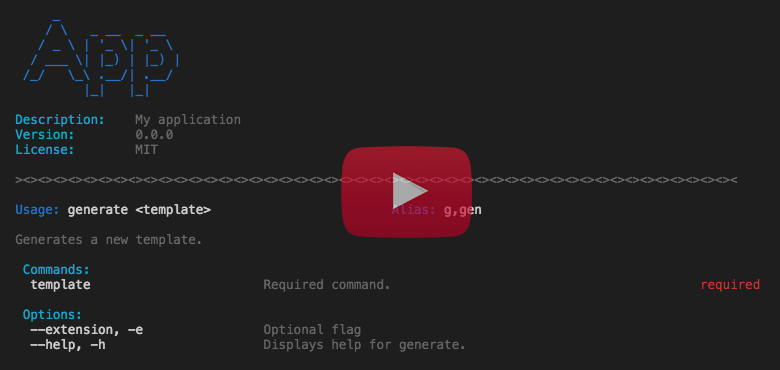

# Pargv 2.x

Pargv has been rewritten in TypeScript as of version **2.0.0**. If you need the last legacy version you can install **1.5.1** although you probably don't want that.

Pargv is similar to Yargs, Commander, Minimist with a handful of additional features not to mention is written in TypeScript which is quite helpful with teams.

The command systax is a snap and makes fleshing out commands quick then you can go back later to even further dress them up. Check out the video for the complete low down.

Pargv also supports calling external batch files and/or scripts. See the [EXAMPLES.md](EXAMPLES.md) for usage examples.

Pargv can also be easily wired up to tools such as [Inquirer](https://github.com/SBoudrias/Inquirer.js) or [Vorpal](https://github.com/dthree/vorpal). Both great tools for prompting but in some cases tools such as Pargv, Yargs, Commander etc. are a little more advanced with their parsing.

Check out the video below it will be quite helpful. Please report bugs! We're not perfect and always open to a better way.

[](https://www.youtube.com/watch?v=c2tg32oNC8E)

### Tutorial Video

See >> [https://www.youtube.com/watch?v=c2tg32oNC8E](https://www.youtube.com/watch?v=c2tg32oNC8E)

## Installation

You can probably do this in your sleep but for completeness...

```sh
$ npm install pargv
```

OR (exlude dev dependencies)

```sh
$ npm install pargv  --production
```

## Quick Start

Import or require then new up an instance of Pargv.

### Basic Example

```ts
import { Pargv } from 'pargv';

// For ES5
// const Pargv = require('pargv').Pargv;

const pargv = new Pargv(/* your options */);

pargv.command('generate <template>')
  .action((template, parsed, command) => {
    // template - the <template> sub command you defined in your command.
    // parsed - the resulting parsed object see more on this below.
    // command - the command instance that Pargv generated.
  });

const parsed = pargv.parse(); // if array of args not passed process.argv will be used.
```

### Advanced Example

```ts
import { Pargv } from 'pargv';

// For ES5
// const Pargv = require('pargv').Pargv;

const pargv = new Pargv({ locale: 'en', headingDivider: '#', extendCommands: true });

// Command requires template name with optiona directory path.
pargv.command('generate <template> [directory]')

  // Creates option extension with description.
  .option('--extension, --ext [ext]', 'The template\'s extension.')

  // Option to mock force.
  .option('--force, -f', 'When present forces overwrite')

  // Adds alias for extension.
  .alias('--extension', '-e')

  // Adds description for "directory" sub command.
  .describe('directory', 'The directory path to save the template to.')

  // Note we specify --ext, we could also specify -e or --extension
  // Pargv will figure it out meaning you can use the primary or an alias
  // as your key.
  .when('--force', '--ext')

  // Sets a default value for the extension option.
  .default('--extension', '.html')

  // Ensures the value for extension is contained in our expression.
  .coerce('--extension', /^\.(html|hbs|ejs)$/, 'could set default val here as well')

  .coerce('directory', (value, command) => {
    // value is the argument value.
    // command the PargvCommand instance.
    // do something and return value.
    return value;
  })

  .action((template, parsed, command) => {
    // template - the <template> sub command you defined in your command.
    // parsed - the resulting parsed object see more on this below.
    // command - the command instance that Pargv generated.
  })
  .exec(); // the above action will be called.
```

More [EXAMPLES.md](EXAMPLES.md) here.

## Options

Pargv options, descriptions and defaults.

<table>
  <thead>
    <tr><th>Option</th><th>Description</th><th>Default</th></tr>
  </thead>
  <tbody>
    <tr><td>cast</td><td>When true Pargv tries to auto cast values to type.</td><td>True</td></tr>
    <tr><td>colorize</td><td>Whether to use colors in help/log messages.</td><td>True</td></tr>
    <tr><td>splitArgs</td><td>when args[0] is ONLY arg and string split to array by specified char. Null to disable.</td><td>null</td></tr>
    <tr><td>headingDivider</td><td>A string repeated for heading/footing in help.</td><td>=</td></tr>
    <tr><td>itemDivider</td><td>A string divider repeated between command help.</td><td>=</td></tr>
    <tr><td>locale</td><td>The i18n locale to use for messages/help.</td><td>en</td></tr>
    <tr><td>localeDir</td><td>A directory for locales if u wish to roll your own.</td><td>undefined</td></tr>
    <tr><td>autoHelp</td><td>When true help is displayed when exec cannot find matching command.</td><td>True</td></tr>
    <tr><td>defaultHelp</td><td>When true commands automatically to help.</td><td>True</td></tr>
      <tr><td>exitHelp</td><td>Exit after displaying help.</td><td>True</td></tr>
    <tr><td>extendCommands</td><td>When true known sub commands extended as properties in result.</td><td>False</td></tr>
    <tr><td>extendAliases</td><td>When true option aliases extended to result.</td><td>False</td></tr>
    <tr><td>extendStats</td><td>When true stats object is extended to results.</td><td>False</td></tr>
    <tr><td>spreadCommands</td><td>When true commands are spread in action callback.</td><td>True</td></tr>
    <tr><td>allowAnonymous</td><td>When true anonymous sub commands and options are allowed.</td><td>True</td></tr>
    <tr><td>ignoreTypeErrors</td><td>When true type checking is ignored.</td><td>False</td></tr>
    <tr><td>castBeforeCoerce</td><td>When true will attempt to cast to type before coerce is called.</td><td>True</td></tr>
    <tr><td>displayStackTrace</td><td>When true stack trace is displayed for errors.</td><td>True</td></tr>
    <tr><td>exitOnError</td><td>When true Pargv exists after errors.</td><td>True</td></tr>
    <tr><td>layoutWidth</td><td>The width of help text layout.</td><td>80</td></tr>
    <tr><td>colors</td>
    <td colspan="2">
      <table width="100%">
        <thead>
        <tr><th>Option</th><th>Description</th><th>Default</th></tr>
        </thead>
        <tbody>
        <tr><td>primary</td><td>The primary color in help.</td><td>blue</td></tr>
        <tr><td>accent</td><td>The accent color in help.</td><td>cyan</td></tr>
        <tr><td>alert</td><td>The alert, error or required color in help.</td><td>red</td></tr>
        <tr><td>muted</td><td>The muted color in help.</td><td>gray</td></tr>
        </tbody>
      </table>
    </td>
    </tr>
  </tbody>
</table>

### Colors

For supported colors see [colurs](https://github.com/origin1tech/colurs). The below
colors property in options suports single string value or array of strings
supported in colurs.

For example if you wanted the primary color in help to have a background you
might set your options as follows:

```ts
const opts = {
  colors: {
    primary: ['bold', 'bgBlue', 'white'] // result: bold white text with blue background.
  }
}
```

## Parse & Execute

Using our above example to call the action associated with **generate** we would call the exec method. Calling the exec method parses your arguments and then calls the associated action.

If you do not wish to execute the action you can simply parse and handle the result yourself.

#### Exec Method

```ts
pargv.exec(process.argv);
```

#### Parse Method

```ts
const parsed = pargv.parse(process.argv)
```

#### Parsed Result

Consider the following executed in your terminal and its corresponding configuration below:

```sh
$ app generate about --ext .html
```

```ts
const parsed = pargv.command('generate <template> --ext <ext>')
  .parse(process.argv);
```

The parsed result would be:

```ts
parsed = {
  $exec: 'example',
  $command: 'generate',
  $commands: [ 'about' ],
  $source: [ 'generate', 'about', '--ext', '.html' ],
  ext: '.html'
}
```

## Convention Syntax & Types

The following section describes how Pargv parses tokens and conventions in your commands and options as well as how built in Type casting and type checks work.

### Pargv Syntax

Commands and options have a handy syntax that limits the need for
chained calls. For example to denote an argument as required simply
wrap in **<value>**. See below for more examples.

#### Tokens

<table>
  <thead>
    <tr><th>Argument</th><th>Description</th></tr>
  </thead>
  <tbody>
    <tr><td>`<value>`</td><td>denotes a required command or option.</td></tr>
    <tr><td>`[value]`</td><td>denotes an optional command or option.</td></tr>
    <tr><td>--option</td><td>denotes an option flag.</td></tr>
    <tr><td>-o</td><td>denotes short option flag.</td></tr>
    <tr><td>generate.gen.g</td><td>results in gen & g as aliases for generate command.</td></tr>
    <tr><td>--extension.ext.e</td><td>results in ext & e as aliases for extension option.</td></tr>
    <tr><td>`[value:float]`</td><td>value should be of type float.</td></tr>
    <tr><td>-fsb</td><td>single - breaks out to '-f', '-s', '-b'</td></tr>
    <tr><td>--ext=.html</td><td>is the same as --ext .html</td></tr>
  </tbody>
</table>

### Commands, Options & Chaining API

You can create your commands and options using Pargv's syntax or using the
chaining API. Both do exactly the same and support either or as well as both.
There are some features which are only available through the chaining API but
we'll get to those in a moment.

```ts
// Command: login           Aliases: log, l
// Sub Command: url        (required)
// Option: username         Aliases: --user, -u
// Option: password         Aliases: --pass, -p
pargv.command('login.log.l <url> --username.user.u [username] --password.pass.p [password]');

// The below is the same as above.
pargv.command('login <url>')
  .alias('login', 'log', 'l') // or .alias('login', ['log', 'l'])
  .option('--username, --user, -u [username]')
  .option('--password, --pass, -p [password]');
```

### Spcifying Types

When creating a command or option you can specify types
for sub commands and options which take values. Pargv will then
attempt to cast to these types where applicable and also do some
type checking to ensure the result is the correct type. If you wish
you can allow casting but disable type checking when initializing
Pargv (see options).

Essentially these types are nothing more than internal coercions methods.
If you choose to pass a custom coercion method then any defined types
will be ignored as Pargv assumes you want to handle that manually.

The following are the current supported types:

date, boolean, array, regexp, object
number, float, integer, string, json

```ts
// Creates Command: query
// Requires sub command: table
// Option: start          Type: date
// Option: end            Type: date
// Option: max            Type: integer
pargv.command('query <table> --start [start:date] --end [end:date] --max [max:integer]');
```

### Argument Conventions

Arguments can be entered in your terminal in a couple different ways for certain types and options. For example you can enter flag options as follows:

```sh
$ generate contact --ext .html
```

**OR**

```sh
$ generate contact --ext=.html
```
For puposes of this example assume we have the following option flags
in our config. In this case we're mocking overwriting a template
after backing it up and then we want to publish our changes. Again
This is just all a mock but you get the idea.

NOTE: In our example below how -fbp are all together. This is possible
when prefixed with a single -.

Pargv will then breakout each flag to its own argument.

-f force
-b backup
-p publish

```sh
$ generate aboutus --ext .html -fbp
```

**Becomes**

```ts
const args = ['generate', 'aboutus', '--ext', '.html', '-f', '-b', '-p'];
```

## API

This section describes both Pargv api methods as well as PargvCommand api methods. One of the things that many find confusing when using parsing libs with chaining is how they work with multiple commands or nesting commands. Lets first cover the methods for each and then explain how they work together to accomplish what you need.

You will notice a few special characters in the "arguments" for the method's signature. This is taken from TypeScript. If you are not using TypeScript that's fine and has no relevance other than to denote the characteristics of each argument. TypeScript simply uses these tokens for realtime type checking.

Again if you are not using TypeScirpt don't worry they aren't needed it's just a way of describing what each method expects.

+ **any**       - means any type
+ **?**         - means it's optional.
+ **[]**        - means an array of some type like string[].
+ **...**       - indicates a spread operator.
+ **T**         - indicates generic type (if not using TypeScript you can ignore).

For the following take a look at the [interfaces](dist/interfaces.d.ts) for more on what these objects contain. The below is NOT a complete list be sure to see interfaces for more info along with docs.

+ **IPargvOptions** - denotes the Pargv options object.
+ **IPargvResult** - the resulting object after parse is called.
+ **IPargvLayout** - helpers/wrapper to [cliui](https://github.com/yargs/cliui) for displaying help text.
+ **IPargvLogo** - helpers/wrapper to [figlet](https://github.com/patorjk/figlet.js)
+ **IPargvEnv** - interface containing environment info.
+ **IPargvCompletionPaths** - interface containing paths used in tab completions.
+ **IPargvMetadata** - interface containing metadata for program.
+ **IPargvLocalize** - interface for localization helper methods.
+ **AnsiStyles** - type containing supported [colurs](https://github.com/origin1tech/colurs) styles.
+ **HelpHandler** - an override callback to be called for help.
+ **CoerceHandlerk** - callback used for custom coercion.
+ **IPargvCoerceConfig** - an object containing coerce configuration.
+ **IPargvWhenConfig** - an object containing when configuration.
+ **ErrorHandler** - custom handler for handling errors.
+ **ActionHandler** - handler for command action callbacks.
+ **CompletionHandler** - handler used for replying with tab completion results.
+ **IMap`<T>`**   - simple type which basically represents an object literal.

### Pargv

Always check [docs](docs/index.html) the below is for conveience and may not represent all methods.

<table>
  <thead>
    <tr><th>Method</th><th>Description</th><th>Params</th><th>Returns</th></tr>
  </thead>
  <tbody>
    <tr><td>$</td><td>returns a default instance you can use to parse args without a command.</td><td>n/a</td><td>PargvCommand</td></tr>
    <tr><td>name</td><td>name of your program.</td><td>val: string, styles?: AnsiStyles | AnsiStyles[], font?: string</td><td>Pargv</td></tr>
    <tr><td>version</td><td>program version.</td><td>val: string</td><td>Pargv</td></tr>
    <tr><td>description</td><td>program description.</td><td>val: string</td><td>Pargv</td></tr>
    <tr><td>license</td><td>program license type.</td><td>val: string</td><td>Pargv</td></tr>
    <tr><td>epilog</td><td>closing message in help ex: copyright Pargv 2018.</td><td>val: string</td><td>Pargv</td></tr>
    <tr><td>command</td><td>primary method creates a PargvCommand.</td><td>command: string, describe?: string</td><td>PargvCommand</td></tr>
    <tr><td>parse</td><td>parses arguments returns result.</td><td>...args: any[]</td><td>IPargvResult</td></tr>
    <tr><td>exec (or listen)</td><td>parses arguments then executes action.</td><td>...args: any[]</td><td>IPargvResult</td></tr>
    <tr><td>onHelp</td><td>overrides default help handler.</td><td>fn: HelpHandler</td><td>Pargv</td></tr>
    <tr><td>get.option</td><td>gets value for option.</td><td>key: string</td><td>any</td></tr>
    <tr><td>set.option</td><td>sets value for option.</td><td>key: string | IPargvOptions, val: any</td><td>Pargv</td></tr>
    <tr><td>show.help</td><td>displays help text for all or specified command.</td><td>command?: string | PargvCommand</td><td>void</td></tr>
    <tr><td>get.help</td><td>gets help text for all or specified command.</td><td>command?: string | PargvCommand</td><td>void</td></tr>
    <tr><td>get.completion</td><td>gets the completion script for manual install.</td><td>n/a</td><td>string</td></tr>
    <tr><td>show.completion</td><td>shows the completion script for manual in terminal.</td><td>n/a</td><td>void</td></tr>
    <tr><td>find.command</td><td>returns a command instance if found.</td><td>key: string</td><td>PargvCommand</td></tr>
    <tr><td>remove.command</td><td>removes a command instance if found.</td><td>key: string</td><td>Pargv</td></tr>
    <tr><td>get.env</td><td>gets environment paths and properties.</td><td>n/a</td><td>IPargvEnv</td></tr>
    <tr><td>show.env</td><td>displays environment paths and properties.</td><td>n/a</td><td>Pargv</td></tr>
    <tr><td>onError</td><td>overrides default on error handler.</td><td>fn: ErrorHandler</td><td>Pargv</td></tr>
    <tr><td>onLog</td><td>overrides default on log handler.</td><td>fn: LogHandler</td><td>Pargv</td></tr>
    <tr><td>reset</td><td>deletes all commands and updates options if provided.</td><td>options?: IPargvOptions</td><td>Pargv</td></tr>
    <tr><td>stats</td><td>compares args to command config returning stats/metadata.</td><td>command: string, ...args: any[]</td><td>Pargv</td></tr>
    <tr><td>logo</td><td>wrapper to output Figlet type logo.</td><td>text?: string | IFigletOptions, font?: string, styles?: AnsiStyles | AnsiStyles[]</td><td>IPargvLogo</td></tr>
    <tr><td>layout</td><td>wrapper/helper for building help using cliui.</td><td>width?: number, wrap?: boolean</td><td>IPargvLogo</td></tr>
  </tbody>
</table>

### Pargv Command

Always check [docs](docs/index.html) the below is for conveience and may not represent all methods.

<table>
  <thead>
    <tr><th>Method</th><th>Description</th><th>Params</th><th>Returns</th></tr>
  </thead>
  <tbody>
    <tr><td>command</td><td>primary method creates a PargvCommand.</td><td>command: string, describe?: string</td><td>PargvCommand</td></tr>
    <tr><td>option</td><td>adds an option to the command.</td><td>token: string, describe?: string, def?: any, type?: string | RegExp | CoerceHandler</td><td>PargvCommand</td></tr>
    <tr><td>alias</td><td>adds an alias to the command.</td><td>key: string | IMap< string[], ...alias: string[]</td><td>PargvCommand</td></tr>
    <tr><td>describe</td><td>adds a description for command or option.</td><td>key: string | IMap< string >, describe?: string</td><td>PargvCommand</td></tr>
    <tr><td>coerce</td><td>adds a coercion type/method to the specified command or option.</td><td>key: string | IMap< IPargvCoerceConfig >, fn?: string | RegExp | CoerceHandler, def?: any</td><td>PargvCommand</td></tr>
    <tr><td>demand</td><td>adds a demand requiring the specified command or option.</td><td>...keys: string[]</td><td>PargvCommand</td></tr>
    <tr><td>when</td><td>requires sibling command or option when present.</td><td>key: string | IMap< IPargvWhenConfig >, demand?: string | boolean, converse?: boolean</td><td>PargvCommand</td></tr>
    <tr><td>default</td><td>adds a default value for command or option.</td><td>key: string | IMap< any >, val: any</td><td>PargvCommand</td></tr>
    <tr><td>completionFor</td><td>adds custom completion for variable.</td><td>key: string, ...vals: any[]</td><td>PargvCommand</td></tr>
    <tr><td>min</td><td>add min requirement of commands or options.</td><td>n/a</td><td>{ commands: (count: number), options: (count: number) }</td></tr>
    <tr><td>max</td><td>add max requirement of commands or options.</td><td>n/a</td><td>{ commands: (count: number), options: (count: number) }</td></tr>
    <tr><td>action</td><td>an action to be called when a command is matched on exec.</td><td>fn: ActionCallback</td><td>PargvCommand</td></tr>
    <tr><td>example</td><td>adds an example for the given command.</td><td>example: string, describe?: string</td><td>PargvCommand</td></tr>
    <tr><td>parse</td><td>parses arguments returns result.</td><td>...args: any[]</td><td>IPargvResult</td></tr>
    <tr><td>exec</td><td>parses arguments then executes action.</td><td>...args: any[]</td><td>IPargvResult</td></tr>
    <tr><td>help</td><td>creates custom help method or disables.</td><td>fn: boolean | HelpHandler</td><td>Pargv</td></tr>
    <tr><td>fail</td><td>overrides default on error handler.</td><td>fn: ErrorHandler</td><td>Pargv</td></tr>
    <tr><td>epilog</td><td>closing message in help ex: copyright Pargv 2018.</td><td>val: string</td><td>Pargv</td></tr>
  </tbody>
</table>

## Localization

The following are the supported languages however you could certainly copy the built in locales located in **node_modules/pargv/locales** of your project and then extend with whatever language you prefer. It's as simple as creating a copy of **en.json** file then changing the values to your language. Then initialize Pargv with that locale and you're off.

+ English
+ Spanish
+ French
+ Hindi
+ Italian
+ Japanese
+ Russian
+ Chinese (Simplified)
+ Chinese (Traditional)

## Examples

See [EXAMPLES.md](EXAMPLES.md)

## Change

See [CHANGE.md](CHANGE.md)

## License

See [LICENSE.md](LICENSE.md)
